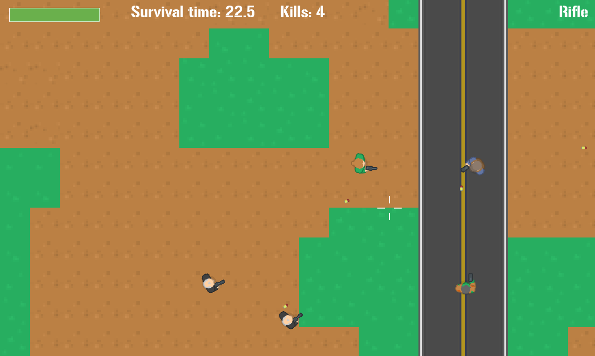

# Alive: the game

Top-down survival shooter: survive as long as you can!

### Ludum Dare 46 game jam submission.

**Play it here**: https://lchsk.com/alive_game

Ludum Dare 46 link: https://ldjam.com/events/ludum-dare/46/$200519

Blog article: https://lchsk.com/building-a-video-game-in-c-for-a-weekend-game-jam.html

Game play video: https://youtu.be/RhdIpSkOQgM

## Screenshots




## Controls

WASD - movement

Mouse - change direction, Mouse left button - shoot

1, 2, 3 - select weapons

ESC to quit

## How to build

It uses the game engine: https://github.com/lchsk/engine212
Use v1.0 tag of the engine to build the game.

To build you'll need a C compiler and installed SDL libraries.

```
git clone https://github.com/lchsk/engine212
git clone https://github.com/lchsk/alive-game

cd alive-game

make game # to build the desktop version
make web # to build the web version
```

# Credits

## Art

- https://kenney.nl/

## Music

- Zander Noriega, https://opengameart.org/content/fight-them-until-we-cant
CC-BY 3.0

## Sounds

- https://opengameart.org/content/chaingun-pistol-rifle-shotgun-shots
CC-BY 3.0
